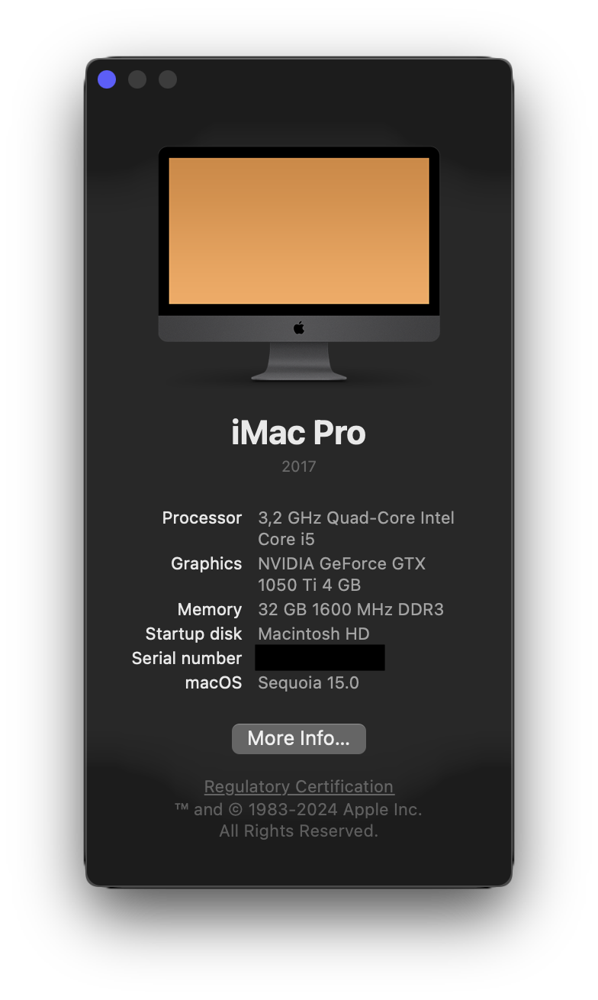

# Hackintosh Sonoma / Sequoia for HP Compaq Pro 6300 / Elite 8300 (OpenCore 1.0.1)

* The colours of this screenshot are incorrect due to a glitch with the Nvidia graphics card and the [HiDPI mode](https://github.com/xzhih/one-key-hidpi). The display looks correct in real life.

## Notes
1. There are two `.plist` files provided in the `OC` folder:
* `config-nvidia.plist` has SIP and Secure Boot disabled for the Nvidia Web Drivers that can be installed with the [OpenCore Legacy Patcher](https://github.com/dortania/OpenCore-Legacy-Patcher/releases/latest) post-installation root patch.
* `config-normal.plist` does not have these modifications.
	
	Rename the one you want to use to `config.plist`.
	
2. Modify `config.plist` for your own serial number, UUID, MLB, ROM, etc. You can generate them with [GenSMBIOS](https://github.com/corpnewt/GenSMBIOS) (use type `iMacPro1,1`). Make sure your generated serial number is NOT valid on the [Apple check coverage page](https://checkcoverage.apple.com/).
3. There are two `.aml` files provided in the `OC/ACPI` folder:
* `SSDT-i5-3470.aml` is designed for the Intel Core i5-3470 (by [tcg96](https://github.com/tcg96))
* `SSDT-i7-3770.aml` is designed for the Intel Core i7-3770 (by [aloha-cn](https://github.com/aloha-cn))

	Rename the one you want to use to `SSDT.aml`. Or you can generate your own with [ssdtPRGen.sh](https://github.com/Piker-Alpha/ssdtPRGen.sh).
	
4. Configure IGPU if you don't use dGPU.
5. These files are very similar to the [repository by aloha-cn](https://github.com/aloha-cn/Hackintosh-HP6300-HP8300-OpenCore). Drivers and OpenCore are updated for compatibility with the newer MacOS versions, and `RestrictEvents.kext` and `revpatch=sbvmm` boot argument are added to enable updates from System Settings.
6. This was only tested on a SATA SSD. To use NVMe SSD or Apple PCIe SSD, you have to use a USB disk for boot (like when starting installation).

## References
https://github.com/Sniki/HP6300-HP8300  
https://github.com/blacklizard/Hackintosh-Opencore-Guide-HP8300-SFF-i5-3470-Catalina  
https://github.com/aloha-cn/Hackintosh-HP6300-HP8300-OpenCore